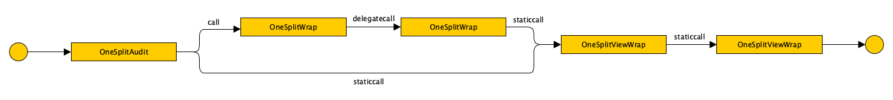
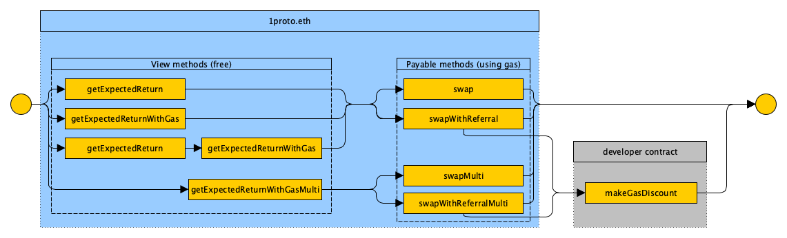

# 1inch on-chain DeFi aggregation protocol

First ever fully on-chain DEX aggregator protocol by 1inch

[](https://travis-ci.org/CryptoManiacsZone/1split)
[](https://coveralls.io/github/CryptoManiacsZone/1split?branch=master)
[](https://docs.openzeppelin.com/)

# Integration

Latest version is always accessible at [1split.eth](https://etherscan.io/address/1split.eth) (beta on [1proto.eth](https://etherscan.io/address/1proto.eth))

Start with checking out solidity interface: [IOneSplit.sol](https://github.com/CryptoManiacsZone/1split/blob/master/contracts/IOneSplit.sol)

## How it works

This smart contract allows to get best price for tokens by aggregating prices from several DEXes.

So far the service works with 2 types of exchages: `split` and `wrap`.

List of `split` exchanges: 
```
let splitExchanges = [
    "Uniswap",
    "Kyber",
    "Bancor",
    "Oasis",
    "Curve Compound",
    "Curve USDT",
    "Curve Y",
    "Curve Binance",
    "Curve Synthetix",
    "Uniswap Compound",
    "Uniswap CHAI",
    "Uniswap Aave",
    "Mooniswap",
    "Uniswap V2",
    "Uniswap V2 ETH",
    "Uniswap V2 DAI",
    "Uniswap V2 USDC",
    "Curve Pax",
    "Curve renBTC",
    "Curve tBTC",
    "Dforce XSwap",
    "Shell",
    "mStable mUSD"
]
```

List of `wrap` exchanges:  
```
let wrapExchanges = [
    "CHAI",
    "BDAI",
    "Aave",
    "Fulcrum",
    "Compound",
    "Iearn",
    "Idle",
    "WETH"
]
```



## How to use it

To use this service you have to call methods at [OneSplitAudit](https://github.com/CryptoManiacsZone/1inchProtocol/blob/master/contracts/OneSplitAudit.sol)



To swap tokens you have to figure out way from left to right points by one of paths on scheme above.

For example, first of all call method `getExpectedReturn` (see methods section), it returns `distribution` array. Each element of this array matches element of `splitExchanges` (see above) and represents fraction of trading volume.<br>
Then call `getExpectedReturnWithGas` to take into account gas when splitting. This method returns more profitable `distribution` array for exchange.<br>
Then call method `swap` or `swapWithReferral` (see methods section) with param `distribution` which was recieved earlier from method `getExpectedReturn`.

Swap may be customized by flags (see flags section). There are 2 types of swap: direct swap and swap over transitional token.

In case of direct swap each element of `distribution` array matches element of `splitExchanges` and represents fraction of trading off token as alerady described above.

In case of swap with transitional token each element of `distribution` (256 bits) matches 2 swaps: second bytes are equal to swap to transitional token, lowest bytes are equal to swap to the desired token.

## Supported DEXes

- [Uniswap](https://v1.uniswap.exchange/)
- [Uniswap V2](https://uniswap.exchange/)
- [Kyber](https://kyber.network/)
- [Bancor](https://bancor.network/)
- [Oasis](https://oasis.app/)
- [Curve](https://curve.fi/)
- [Mooniswap]()
- [Dforce XSwap](https://trade.dforce.network/)
- [Shell](https://www.shellprotocol.io/)
- [mStable](https://app.mstable.org/)
- [CHAI](https://Chai.money/)
- [BDAI](https://btu-protocol.com/)
- [Aave](https://aave.com/)
- [Fulcrum](https://fulcrum.trade/)
- [Compound](https://compound.finance/)
- [Iearn](https://iearn.finance/)
- [Idle](https://idle.finance/)
- [WETH](https://weth.io/ru/)


## Methods

If you need Ether instead of any token use `address(0)` or `address(0xEeeeeEeeeEeEeeEeEeEeeEEEeeeeEeeeeeeeEEeE)` as param `fromToken`/`destToken`

- **getExpectedReturn(fromToken, destToken, amount, parts, flags)**

  Calculate expected returning amount of desired token

  | Params | Type | Description |
  | ----- | ----- | ----- |
  | fromToken | IERC20 | Address of trading off token |
  | destToken | IERC20 | Address of desired token |
  | amount | uint256 | Amount for `fromToken` |
  | parts | uint256 | Number of pieces source volume could be splitted (Works like granularity, higly affects gas usage. Should be called offchain, but could be called onchain if user swaps not his own funds, but this is still considered as not safe) |
  | flags | uint256 | Flags for enabling and disabling some features (default: `0`), see flags description |
  
  Return values: 

  | Params | Type | Description |
  | ----- | ----- | ----- |
  | returnAmount | uint256 | Expected returning amount of desired token |
  | distribution | uint256[] | Array of weights for volume distribution  |
  
  **Notice:** This method is equal to `getExpectedReturnWithGas(fromToken, destToken, amount, parts, flags, 0)`

  **Example:**
  ```
  let Web3 = require('web3')

  let provider = new Web3.providers.WebsocketProvider('wss://mainnet.infura.io/ws/v3/YOUR_TOKEN')
  let web3 = new Web3(provider)

  let ABI = [{"inputs":[{"internalType":"contract IOneSplitMulti","name":"impl","type":"address"}],"payable":false,"stateMutability":"nonpayable","type":"constructor"},{"anonymous":false,"inputs":[{"indexed":true,"internalType":"address","name":"newImpl","type":"address"}],"name":"ImplementationUpdated","type":"event"},{"anonymous":false,"inputs":[{"indexed":true,"internalType":"address","name":"previousOwner","type":"address"},{"indexed":true,"internalType":"address","name":"newOwner","type":"address"}],"name":"OwnershipTransferred","type":"event"},{"anonymous":false,"inputs":[{"indexed":true,"internalType":"contract IERC20","name":"fromToken","type":"address"},{"indexed":true,"internalType":"contract IERC20","name":"destToken","type":"address"},{"indexed":false,"internalType":"uint256","name":"fromTokenAmount","type":"uint256"},{"indexed":false,"internalType":"uint256","name":"destTokenAmount","type":"uint256"},{"indexed":false,"internalType":"uint256","name":"minReturn","type":"uint256"},{"indexed":false,"internalType":"uint256[]","name":"distribution","type":"uint256[]"},{"indexed":false,"internalType":"uint256[]","name":"flags","type":"uint256[]"},{"indexed":false,"internalType":"address","name":"referral","type":"address"},{"indexed":false,"internalType":"uint256","name":"feePercent","type":"uint256"}],"name":"Swapped","type":"event"},{"payable":true,"stateMutability":"payable","type":"fallback"},{"constant":true,"inputs":[],"name":"chi","outputs":[{"internalType":"contract IFreeFromUpTo","name":"","type":"address"}],"payable":false,"stateMutability":"view","type":"function"},{"constant":false,"inputs":[{"internalType":"contract IERC20","name":"asset","type":"address"},{"internalType":"uint256","name":"amount","type":"uint256"}],"name":"claimAsset","outputs":[],"payable":false,"stateMutability":"nonpayable","type":"function"},{"constant":true,"inputs":[{"internalType":"contract IERC20","name":"fromToken","type":"address"},{"internalType":"contract IERC20","name":"destToken","type":"address"},{"internalType":"uint256","name":"amount","type":"uint256"},{"internalType":"uint256","name":"parts","type":"uint256"},{"internalType":"uint256","name":"flags","type":"uint256"}],"name":"getExpectedReturn","outputs":[{"internalType":"uint256","name":"returnAmount","type":"uint256"},{"internalType":"uint256[]","name":"distribution","type":"uint256[]"}],"payable":false,"stateMutability":"view","type":"function"},{"constant":true,"inputs":[{"internalType":"contract IERC20","name":"fromToken","type":"address"},{"internalType":"contract IERC20","name":"destToken","type":"address"},{"internalType":"uint256","name":"amount","type":"uint256"},{"internalType":"uint256","name":"parts","type":"uint256"},{"internalType":"uint256","name":"flags","type":"uint256"},{"internalType":"uint256","name":"destTokenEthPriceTimesGasPrice","type":"uint256"}],"name":"getExpectedReturnWithGas","outputs":[{"internalType":"uint256","name":"returnAmount","type":"uint256"},{"internalType":"uint256","name":"estimateGasAmount","type":"uint256"},{"internalType":"uint256[]","name":"distribution","type":"uint256[]"}],"payable":false,"stateMutability":"view","type":"function"},{"constant":true,"inputs":[{"internalType":"contract IERC20[]","name":"tokens","type":"address[]"},{"internalType":"uint256","name":"amount","type":"uint256"},{"internalType":"uint256[]","name":"parts","type":"uint256[]"},{"internalType":"uint256[]","name":"flags","type":"uint256[]"},{"internalType":"uint256[]","name":"destTokenEthPriceTimesGasPrices","type":"uint256[]"}],"name":"getExpectedReturnWithGasMulti","outputs":[{"internalType":"uint256[]","name":"returnAmounts","type":"uint256[]"},{"internalType":"uint256","name":"estimateGasAmount","type":"uint256"},{"internalType":"uint256[]","name":"distribution","type":"uint256[]"}],"payable":false,"stateMutability":"view","type":"function"},{"constant":true,"inputs":[],"name":"isOwner","outputs":[{"internalType":"bool","name":"","type":"bool"}],"payable":false,"stateMutability":"view","type":"function"},{"constant":true,"inputs":[],"name":"oneSplitImpl","outputs":[{"internalType":"contract IOneSplitMulti","name":"","type":"address"}],"payable":false,"stateMutability":"view","type":"function"},{"constant":true,"inputs":[],"name":"owner","outputs":[{"internalType":"address","name":"","type":"address"}],"payable":false,"stateMutability":"view","type":"function"},{"constant":false,"inputs":[],"name":"renounceOwnership","outputs":[],"payable":false,"stateMutability":"nonpayable","type":"function"},{"constant":false,"inputs":[{"internalType":"contract IOneSplitMulti","name":"impl","type":"address"}],"name":"setNewImpl","outputs":[],"payable":false,"stateMutability":"nonpayable","type":"function"},{"constant":false,"inputs":[{"internalType":"contract IERC20","name":"fromToken","type":"address"},{"internalType":"contract IERC20","name":"destToken","type":"address"},{"internalType":"uint256","name":"amount","type":"uint256"},{"internalType":"uint256","name":"minReturn","type":"uint256"},{"internalType":"uint256[]","name":"distribution","type":"uint256[]"},{"internalType":"uint256","name":"flags","type":"uint256"}],"name":"swap","outputs":[{"internalType":"uint256","name":"","type":"uint256"}],"payable":true,"stateMutability":"payable","type":"function"},{"constant":false,"inputs":[{"internalType":"contract IERC20[]","name":"tokens","type":"address[]"},{"internalType":"uint256","name":"amount","type":"uint256"},{"internalType":"uint256","name":"minReturn","type":"uint256"},{"internalType":"uint256[]","name":"distribution","type":"uint256[]"},{"internalType":"uint256[]","name":"flags","type":"uint256[]"}],"name":"swapMulti","outputs":[{"internalType":"uint256","name":"","type":"uint256"}],"payable":true,"stateMutability":"payable","type":"function"},{"constant":false,"inputs":[{"internalType":"contract IERC20","name":"fromToken","type":"address"},{"internalType":"contract IERC20","name":"destToken","type":"address"},{"internalType":"uint256","name":"amount","type":"uint256"},{"internalType":"uint256","name":"minReturn","type":"uint256"},{"internalType":"uint256[]","name":"distribution","type":"uint256[]"},{"internalType":"uint256","name":"flags","type":"uint256"},{"internalType":"address","name":"referral","type":"address"},{"internalType":"uint256","name":"feePercent","type":"uint256"}],"name":"swapWithReferral","outputs":[{"internalType":"uint256","name":"","type":"uint256"}],"payable":true,"stateMutability":"payable","type":"function"},{"constant":false,"inputs":[{"internalType":"contract IERC20[]","name":"tokens","type":"address[]"},{"internalType":"uint256","name":"amount","type":"uint256"},{"internalType":"uint256","name":"minReturn","type":"uint256"},{"internalType":"uint256[]","name":"distribution","type":"uint256[]"},{"internalType":"uint256[]","name":"flags","type":"uint256[]"},{"internalType":"address","name":"referral","type":"address"},{"internalType":"uint256","name":"feePercent","type":"uint256"}],"name":"swapWithReferralMulti","outputs":[{"internalType":"uint256","name":"returnAmount","type":"uint256"}],"payable":true,"stateMutability":"payable","type":"function"},{"constant":false,"inputs":[{"internalType":"address","name":"newOwner","type":"address"}],"name":"transferOwnership","outputs":[],"payable":false,"stateMutability":"nonpayable","type":"function"}]
  let CONTRACT_ADDRESS = "0xC586BeF4a0992C495Cf22e1aeEE4E446CECDee0E"

  let contract = new web3.eth.Contract(ABI, CONTRACT_ADDRESS)
  contract.methods.getExpectedReturn(
      "0xEeeeeEeeeEeEeeEeEeEeeEEEeeeeEeeeeeeeEEeE",
      "0x89d24a6b4ccb1b6faa2625fe562bdd9a23260359",
      100,
      10, 
      0
  ).call().then(data => {
      console.log(`returnAmount: ${data.returnAmount.toString()}`)
      console.log(`distribution: ${JSON.stringify(data.distribution)}`)
  }).catch(error => {
      // TO DO: ...
  });
  ```

- **getExpectedReturnWithGas(fromToken, destToken, amount, parts, flags, destTokenEthPriceTimesGasPrice)**

  Calculate expected returning amount of desired token taking into account how gas protocols affect price

  | Params | Type | Description |
  | ----- | ----- | ----- |
  | fromToken | IERC20 | Address of trading off token |
  | destToken | IERC20 | Address of desired token |
  | amount | uint256 | Amount for `fromToken` |
  | parts | uint256 | Number of pieces source volume could be splitted (Works like granularity, higly affects gas usage. Should be called offchain, but could be called onchain if user swaps not his own funds, but this is still considered as not safe) |
  | flags | uint256 | Flags for enabling and disabling some features (default: `0`), see flags description |
  | destTokenEthPriceTimesGasPrice | uint256 | `returnAmount * gas_price`, where `returnAmount` is result of `getExpectedReturn(fromToken, destToken, amount, parts, flags)` |
  
  Return values: 

  | Params | Type | Description |
  | ----- | ----- | ----- |
  | returnAmount | uint256 | Expected returning amount of desired token |
  | estimateGasAmount | uint256 | Expected gas amount of exchange |
  | distribution | uint256[] | Array of weights for volume distribution  |
  
  **Example:**
  ```
   // TO DO: ...
  ```

- **swap(fromToken, destToken, amount, minReturn, distribution, flags)**

  Swap `amount` of `fromToken` to `destToken`

  | Params | Type | Description |
  | ----- | ----- | ----- |
  | fromToken | IERC20 | Address of trading off token |
  | destToken | IERC20 | Address of desired token |
  | amount | uint256 | Amount for `fromToken` |
  | minReturn | uint256 | Minimum expected return, else revert transaction |
  | distribution | uint256[] | Array of weights for volume distribution (returned by `getExpectedReturn`) |
  | flags | uint256 | Flags for enabling and disabling some features (default: `0`), see flags description |
  
  **Notice:** Make sure the `flags` param coincides `flags` param in `getExpectedReturn` method if you want the same result
  
  **Notice:** This method is equal to `swapWithReferral(fromToken, destToken, amount, minReturn, distribution, flags, address(0), 0)`
  
  Return values: 
  
  | Params | Type | Description |
  | ----- | ----- | ----- |
  | returnAmount | uint256 | Recieved amount of desired token |

  **Example:**
  ```
   // TO DO: ...
  ```

- **swapWithReferral(fromToken, destToken, amount, minReturn, distribution, flags, referral, feePercent)**
  
  Swap `amount` of `fromToken` to `destToken`
  
  | Params | Type | Description |
  | ----- | ----- | ----- |
  | fromToken | IERC20 | Address of trading off token |
  | destToken | IERC20 | Address of desired token |
  | amount | uint256 | Amount for `fromToken` |
  | minReturn | uint256 | Minimum expected return, else revert transaction |
  | distribution | uint256[] | Array of weights for volume distribution (returned by `getExpectedReturn`) |
  | flags | uint256 | Flags for enabling and disabling some features (default: `0`), see flags description |
  | referral | address | Referrer's address (exception with flag `FLAG_ENABLE_REFERRAL_GAS_SPONSORSHIP`) |
  | feePercent | uint256 | Fees percents normalized to 1e18, limited to 0.03e18 (3%) |
  
  **Notice:** Make sure the `flags` param coincides `flags` param in `getExpectedReturn` method if you want the same result
  
  Return values: 
  
  | Params | Type | Description |
  | ----- | ----- | ----- |
  | returnAmount | uint256 | Recieved amount of desired token |

  **Example:**
  ```
   // TO DO: ...
  ```
  
## Flags
### Flag types
  There are basically 3 types of flags:
  1. **Exchange switch**<br>
  This flags allow `1split.eth` to enable or disable using exchange pools for swap. This can be applied for exchanges in genereral, for example: `split`, `wrap`, or this can be applied for a specific exchange type, for example: `bancor`, `oasis`.<br>
  This flags may be used in any combination.<br>
  
  2. **Transitional token selector**<br>
  This flags provide to swap from `fromToken` to `destToken` using transitional token.<br>
  This flags cann't be used in combination with the same type. <br>
  
  3. **Functional flags**<br>
  This flags provide some additional features.<br>
  This flags may be used in any combination.

### Flags description
`flags` param in `1split.eth` methods is sum  of flags values, for example:
```
flags = FLAG_DISABLE_UNISWAP + FLAG_DISABLE_KYBER + ...
```

- **Exchange switch (`Split` exchanges)**
  
  | Flag | Value | Description |
  | ---- | ---- | ---- |
  | FLAG_DISABLE_UNISWAP | `0x01` | Exclude `Uniswap` exchange from swap |
  | FLAG_ENABLE_KYBER_UNISWAP_RESERVE | `0x100000000` | Permit `Kyber` use `Uniswap`, by default it is forbidden |
  | FLAG_ENABLE_KYBER_OASIS_RESERVE | `0x200000000` | Permit `Kyber` use `Oasis`, by default it is forbidden |
  | FLAG_ENABLE_KYBER_BANCOR_RESERVE | `0x400000000` | Permit `Kyber` use `Bancor`, by default it is forbidden |
  | FLAG_DISABLE_BANCOR | `0x04` | Exclude `Bancor` exchange from swap |
  | FLAG_DISABLE_OASIS | `0x08` | Exclude `Oasis` exchange from swap |
  | FLAG_DISABLE_CURVE_COMPOUND | `0x1000` | Exclude `CurveCompound` exchange from swap |
  | FLAG_DISABLE_CURVE_USDT | `0x2000` | Exclude `CurveUsdt` exchange from swap |
  | FLAG_DISABLE_CURVE_Y | `0x4000` | Exclude `CurveY` exchange from swap |
  | FLAG_DISABLE_CURVE_BINANCE | `0x8000` | Exclude `CurveBinance` exchange from swap |
  | FLAG_DISABLE_CURVE_SYNTHETIX | `0x40000` | Exclude `CurveSynthetix` exchange from swap |
  | FLAG_DISABLE_UNISWAP_COMPOUND | `0x100000` | Forbid `Uniswap` use `Compound`, by default it is permitted. Works only when one of assets is `ETH` |
  | FLAG_DISABLE_UNISWAP_CHAI | `0x200000` | Forbid `Uniswap` use `Chai`, by default it is permitted. Works only when `ETH<>DAI` |
  | FLAG_DISABLE_UNISWAP_AAVE | `0x400000` | Forbid `Uniswap` use `Aave`, by default it is permitted. Works only when one of assets is `ETH` |
  | FLAG_DISABLE_MOONISWAP | `0x1000000` | Exclude `Mooniswap` exchange from swap |
  | FLAG_DISABLE_UNISWAP_V2_ALL | `0x1E000000` | Exclude all exchanges with `UniswapV2` prefix from swap |
  | FLAG_DISABLE_UNISWAP_V2 | `0x2000000` | Exclude `UniswapV2` exchange from swap |
  | FLAG_DISABLE_UNISWAP_V2_ETH | `0x4000000` | Exclude `UniswapV2ETH` exchange from swap |
  | FLAG_DISABLE_UNISWAP_V2_DAI | `0x8000000` | Exclude `UniswapV2DAI` exchange from swap |
  | FLAG_DISABLE_UNISWAP_V2_USDC | `0x10000000` | Exclude `UniswapV2USDC` exchange from swap |
  | FLAG_DISABLE_ALL_SPLIT_SOURCES | `0x20000000` | Exclude all `split` exchages from swap. Inverts `split` tokens flag values |
  | FLAG_DISABLE_CURVE_PAX | `0x80000000` | Exclude `CurvePax` exchange from swap |
  | FLAG_DISABLE_CURVE_RENBTC | `0x100000000` | Exclude `CurveRenBtc` exchange from swap |
  | FLAG_DISABLE_CURVE_TBTC | `0x200000000` | Exclude `CurveTBtc` exchange from swap |
  | FLAG_DISABLE_DFORCE_SWAP | `0x4000000000` | Exclude `DforceSwap` exchange from swap |
  | FLAG_DISABLE_SHELL | `0x8000000000` | Exclude `Shellexchangers` exchange from swap |
  | FLAG_DISABLE_MSTABLE_MUSD | `0x20000000000` | Exclude pool `MUSD` in `mStable` exchange from swap |
  | FLAG_DISABLE_CURVE_SBTC | `0x40000000000` | Exclude pool `SBTC` in `Curve` exchange from swap |
  | FLAG_DISABLE_DMM | `0x80000000000` | Exclude `DMM` exchange from swap |
  | FLAG_DISABLE_UNISWAP_ALL | `0x100000000000` | Exclude all pools in `Uniswap` exchange from swap |
  | FLAG_DISABLE_CURVE_ALL | `0x200000000000` | Exclude all pools in `Curve` exchange from swap |
  | FLAG_DISABLE_BALANCER_ALL | `0x1000000000000` | Exclude all pools in `Balancer` exchange from swap |
  | FLAG_DISABLE_BALANCER_1 | `0x2000000000000` | Exclude the first best pool in `Balancer` exchange from swap |
  | FLAG_DISABLE_BALANCER_2 | `0x4000000000000` | Exclude the second best pool in `Balancer` exchange from swap |
  | FLAG_DISABLE_BALANCER_3 | `0x8000000000000` | Exclude the third best pool in `Balancer` exchange from swap |
  | FLAG_DISABLE_KYBER_ALL | `0x200000000000000` | Exclude all pools in `Kyber` exchange from swap |
  | FLAG_DISABLE_KYBER_1 | `0x400000000000000` | Exclude the first multi-token `Kyber` reserve (exchange of any token to any is possible) from swap (see [KyberReserves](./KyberReserves.md)) |
  | FLAG_DISABLE_KYBER_2 | `0x800000000000000` | Exclude the second multi-token `Kyber` reserve (exchange of any token to any is possible) from swap (see [KyberReserves](./KyberReserves.md)) |
  | FLAG_DISABLE_KYBER_3 | `0x1000000000000000` | Exclude the third multi-token `Kyber` reserve (exchange of any token to any is possible) from swap (see [KyberReserves](./KyberReserves.md)) |
  | FLAG_DISABLE_KYBER_4 | `0x2000000000000000` | Exclude the single-token `Kyber` reserve (single-token reserves does not intersect and the one that fits is selected) from swap (see [KyberReserves](./KyberReserves.md)) |
  
  **Example:**
  ```
  let Web3 = require('web3')

  let provider = new Web3.providers.WebsocketProvider('wss://mainnet.infura.io/ws/v3/YOUR_TOKEN')
  let web3 = new Web3(provider)

  let ABI = [{"inputs":[{"internalType":"contract IOneSplitMulti","name":"impl","type":"address"}],"payable":false,"stateMutability":"nonpayable","type":"constructor"},{"anonymous":false,"inputs":[{"indexed":true,"internalType":"address","name":"newImpl","type":"address"}],"name":"ImplementationUpdated","type":"event"},{"anonymous":false,"inputs":[{"indexed":true,"internalType":"address","name":"previousOwner","type":"address"},{"indexed":true,"internalType":"address","name":"newOwner","type":"address"}],"name":"OwnershipTransferred","type":"event"},{"anonymous":false,"inputs":[{"indexed":true,"internalType":"contract IERC20","name":"fromToken","type":"address"},{"indexed":true,"internalType":"contract IERC20","name":"destToken","type":"address"},{"indexed":false,"internalType":"uint256","name":"fromTokenAmount","type":"uint256"},{"indexed":false,"internalType":"uint256","name":"destTokenAmount","type":"uint256"},{"indexed":false,"internalType":"uint256","name":"minReturn","type":"uint256"},{"indexed":false,"internalType":"uint256[]","name":"distribution","type":"uint256[]"},{"indexed":false,"internalType":"uint256[]","name":"flags","type":"uint256[]"},{"indexed":false,"internalType":"address","name":"referral","type":"address"},{"indexed":false,"internalType":"uint256","name":"feePercent","type":"uint256"}],"name":"Swapped","type":"event"},{"payable":true,"stateMutability":"payable","type":"fallback"},{"constant":true,"inputs":[],"name":"chi","outputs":[{"internalType":"contract IFreeFromUpTo","name":"","type":"address"}],"payable":false,"stateMutability":"view","type":"function"},{"constant":false,"inputs":[{"internalType":"contract IERC20","name":"asset","type":"address"},{"internalType":"uint256","name":"amount","type":"uint256"}],"name":"claimAsset","outputs":[],"payable":false,"stateMutability":"nonpayable","type":"function"},{"constant":true,"inputs":[{"internalType":"contract IERC20","name":"fromToken","type":"address"},{"internalType":"contract IERC20","name":"destToken","type":"address"},{"internalType":"uint256","name":"amount","type":"uint256"},{"internalType":"uint256","name":"parts","type":"uint256"},{"internalType":"uint256","name":"flags","type":"uint256"}],"name":"getExpectedReturn","outputs":[{"internalType":"uint256","name":"returnAmount","type":"uint256"},{"internalType":"uint256[]","name":"distribution","type":"uint256[]"}],"payable":false,"stateMutability":"view","type":"function"},{"constant":true,"inputs":[{"internalType":"contract IERC20","name":"fromToken","type":"address"},{"internalType":"contract IERC20","name":"destToken","type":"address"},{"internalType":"uint256","name":"amount","type":"uint256"},{"internalType":"uint256","name":"parts","type":"uint256"},{"internalType":"uint256","name":"flags","type":"uint256"},{"internalType":"uint256","name":"destTokenEthPriceTimesGasPrice","type":"uint256"}],"name":"getExpectedReturnWithGas","outputs":[{"internalType":"uint256","name":"returnAmount","type":"uint256"},{"internalType":"uint256","name":"estimateGasAmount","type":"uint256"},{"internalType":"uint256[]","name":"distribution","type":"uint256[]"}],"payable":false,"stateMutability":"view","type":"function"},{"constant":true,"inputs":[{"internalType":"contract IERC20[]","name":"tokens","type":"address[]"},{"internalType":"uint256","name":"amount","type":"uint256"},{"internalType":"uint256[]","name":"parts","type":"uint256[]"},{"internalType":"uint256[]","name":"flags","type":"uint256[]"},{"internalType":"uint256[]","name":"destTokenEthPriceTimesGasPrices","type":"uint256[]"}],"name":"getExpectedReturnWithGasMulti","outputs":[{"internalType":"uint256[]","name":"returnAmounts","type":"uint256[]"},{"internalType":"uint256","name":"estimateGasAmount","type":"uint256"},{"internalType":"uint256[]","name":"distribution","type":"uint256[]"}],"payable":false,"stateMutability":"view","type":"function"},{"constant":true,"inputs":[],"name":"isOwner","outputs":[{"internalType":"bool","name":"","type":"bool"}],"payable":false,"stateMutability":"view","type":"function"},{"constant":true,"inputs":[],"name":"oneSplitImpl","outputs":[{"internalType":"contract IOneSplitMulti","name":"","type":"address"}],"payable":false,"stateMutability":"view","type":"function"},{"constant":true,"inputs":[],"name":"owner","outputs":[{"internalType":"address","name":"","type":"address"}],"payable":false,"stateMutability":"view","type":"function"},{"constant":false,"inputs":[],"name":"renounceOwnership","outputs":[],"payable":false,"stateMutability":"nonpayable","type":"function"},{"constant":false,"inputs":[{"internalType":"contract IOneSplitMulti","name":"impl","type":"address"}],"name":"setNewImpl","outputs":[],"payable":false,"stateMutability":"nonpayable","type":"function"},{"constant":false,"inputs":[{"internalType":"contract IERC20","name":"fromToken","type":"address"},{"internalType":"contract IERC20","name":"destToken","type":"address"},{"internalType":"uint256","name":"amount","type":"uint256"},{"internalType":"uint256","name":"minReturn","type":"uint256"},{"internalType":"uint256[]","name":"distribution","type":"uint256[]"},{"internalType":"uint256","name":"flags","type":"uint256"}],"name":"swap","outputs":[{"internalType":"uint256","name":"","type":"uint256"}],"payable":true,"stateMutability":"payable","type":"function"},{"constant":false,"inputs":[{"internalType":"contract IERC20[]","name":"tokens","type":"address[]"},{"internalType":"uint256","name":"amount","type":"uint256"},{"internalType":"uint256","name":"minReturn","type":"uint256"},{"internalType":"uint256[]","name":"distribution","type":"uint256[]"},{"internalType":"uint256[]","name":"flags","type":"uint256[]"}],"name":"swapMulti","outputs":[{"internalType":"uint256","name":"","type":"uint256"}],"payable":true,"stateMutability":"payable","type":"function"},{"constant":false,"inputs":[{"internalType":"contract IERC20","name":"fromToken","type":"address"},{"internalType":"contract IERC20","name":"destToken","type":"address"},{"internalType":"uint256","name":"amount","type":"uint256"},{"internalType":"uint256","name":"minReturn","type":"uint256"},{"internalType":"uint256[]","name":"distribution","type":"uint256[]"},{"internalType":"uint256","name":"flags","type":"uint256"},{"internalType":"address","name":"referral","type":"address"},{"internalType":"uint256","name":"feePercent","type":"uint256"}],"name":"swapWithReferral","outputs":[{"internalType":"uint256","name":"","type":"uint256"}],"payable":true,"stateMutability":"payable","type":"function"},{"constant":false,"inputs":[{"internalType":"contract IERC20[]","name":"tokens","type":"address[]"},{"internalType":"uint256","name":"amount","type":"uint256"},{"internalType":"uint256","name":"minReturn","type":"uint256"},{"internalType":"uint256[]","name":"distribution","type":"uint256[]"},{"internalType":"uint256[]","name":"flags","type":"uint256[]"},{"internalType":"address","name":"referral","type":"address"},{"internalType":"uint256","name":"feePercent","type":"uint256"}],"name":"swapWithReferralMulti","outputs":[{"internalType":"uint256","name":"returnAmount","type":"uint256"}],"payable":true,"stateMutability":"payable","type":"function"},{"constant":false,"inputs":[{"internalType":"address","name":"newOwner","type":"address"}],"name":"transferOwnership","outputs":[],"payable":false,"stateMutability":"nonpayable","type":"function"}]
  let CONTRACT_ADDRESS = "0xC586BeF4a0992C495Cf22e1aeEE4E446CECDee0E"

  let splitExchanges = [
      "Uniswap", "Kyber", "Bancor", "Oasis", "CurveCompound", "CurveUsdt", "CurveY", "CurveBinance", "CurveSynthetix", "UniswapCompound", "UniswapChai", "UniswapAave", "Mooniswap", "UniswapV2", "UniswapV2ETH", "UniswapV2DAI", "UniswapV2USDC", "CurvePax", "CurveRenBtc", "CurveTBtc", "DforceSwap", "Shellexchangers"
  ]
  
  let parts = 10
  
  let contract = new web3.eth.Contract(ABI, CONTRACT_ADDRESS)
  contract.methods.getExpectedReturn(
      "0xEeeeeEeeeEeEeeEeEeEeeEEEeeeeEeeeeeeeEEeE",
      "0x89d24a6b4ccb1b6faa2625fe562bdd9a23260359",
      100,
      parts, 
      0x04
  ).call().then(data => {
  
      data.distribution.forEach(function(value, index) {
          console.log(`${splitExchanges[index]}: ${value*100/parts}%`)
      })
  }).catch(error => {
      // TO DO: ...
  });
  ```

- **Exchange switch (`Wrap` exchanges)**
  
  | Flag | Value | Description |
  | ---- | ---- | ---- |
  | FLAG_DISABLE_COMPOUND | `0x10` | Exclude `Compound` exchange from swap |
  | FLAG_DISABLE_FULCRUM | `0x20` | Exclude `Fulcrum` exchange from swap |
  | FLAG_DISABLE_CHAI | `0x40` | Exclude `Chai` exchange from swap |
  | FLAG_DISABLE_AAVE | `0x80` | Exclude `Aave` exchange from swap |
  | FLAG_DISABLE_SMART_TOKEN | `0x100` | Exclude `SmartToken` exchange from swap |
  | FLAG_DISABLE_BDAI | `0x400` | Exclude `Bdai` exchange from swap |
  | FLAG_DISABLE_IEARN | `0x800` | Exclude `Iearn` exchange from swap |
  | FLAG_DISABLE_WETH | `0x80000` | Exclude `Weth` exchange from swap |
  | FLAG_DISABLE_IDLE | `0x800000` | Exclude `Idle` exchange from swap |
  | FLAG_DISABLE_ALL_WRAP_SOURCES | `0x40000000` | Exclude all `wrap` exchages from swap. Inverts `wrap` tokens flag values |
  
- **Transitional token selector**

  | Flag | Value | Description |
  | ---- | ---- | ---- |
  | FLAG_DISABLE_UNISWAP_COMPOUND | `0x100000` | Exclude `Uniswap` pools with `cTokens` |
  | FLAG_DISABLE_UNISWAP_CHAI | `0x200000` | Exclude `Uniswap` pools with `Chai` |
  | FLAG_DISABLE_UNISWAP_AAVE | `0x400000` | Exclude `Uniswap` pools with `aTokens` |

- **Functional flags**

  | Flag | Value | Description |
  | ---- | ---- | ---- |
  | FLAG_ENABLE_CHI_BURN | `0x10000000000` | Burns `CHI` token to save gas. Make sure to approve `CHI` token to `1split.eth` smart contract |
  | FLAG_ENABLE_CHI_BURN_BY_ORIGIN | `0x4000000000000000` | This flag extends the functionality of `FLAG_ENABLE_CHI_BURN` flag. Burns `CHI` token from address which sign swap transaction instead of address which call swap method |
  | FLAG_ENABLE_REFERRAL_GAS_SPONSORSHIP | `0x80000000000000` | Turning on this flag means that parameter `referral` (method `swapWithReferral`) matches the address of the user smartcontract which has `makeGasDiscount` method. So this method can burn `GAS` token, `CHI` token by itself or it can add other functionality.|
